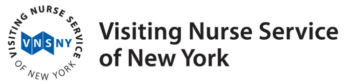
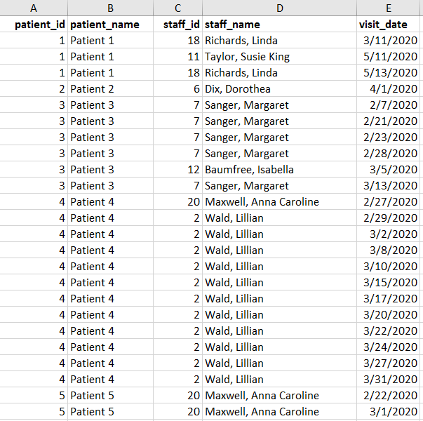
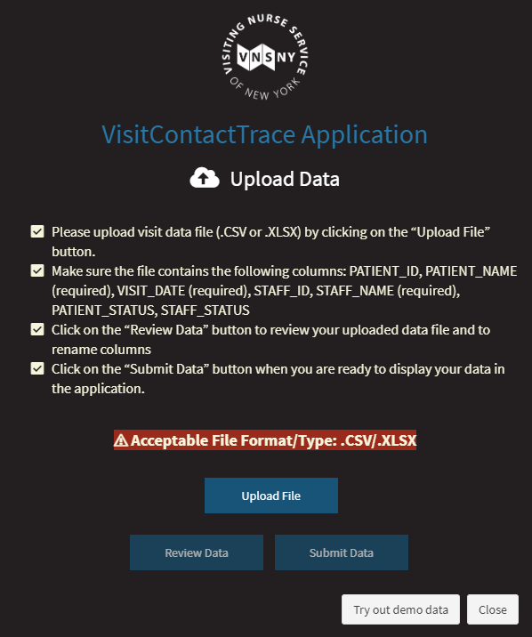
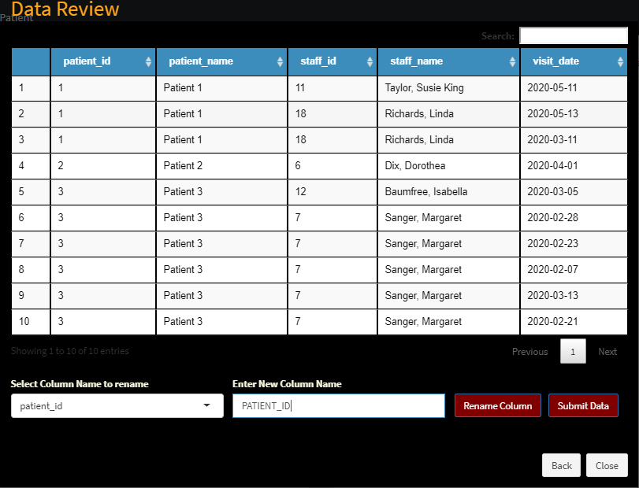
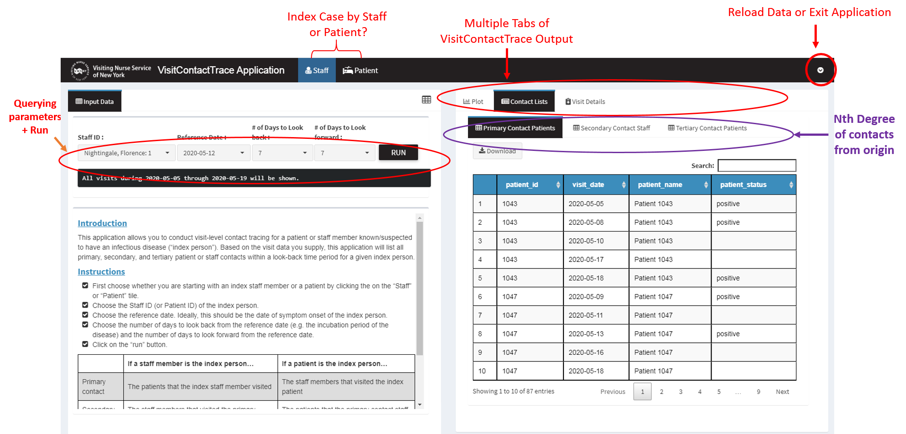
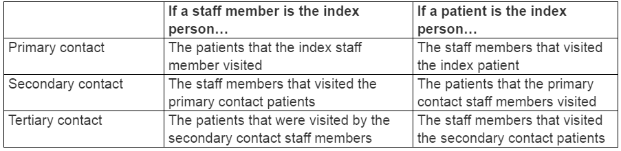
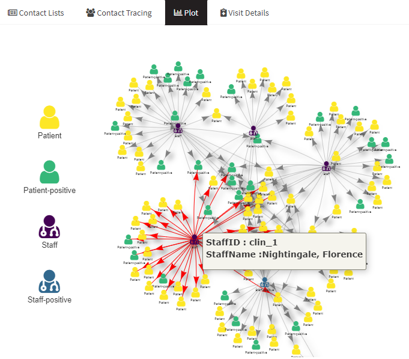
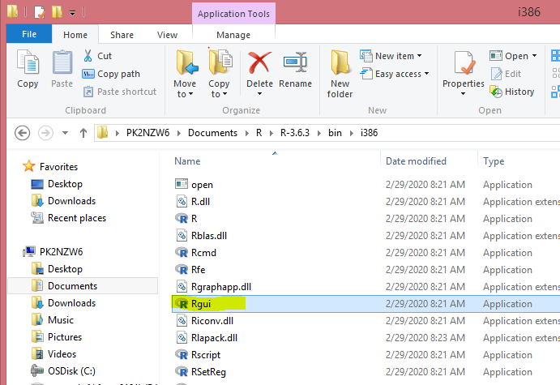
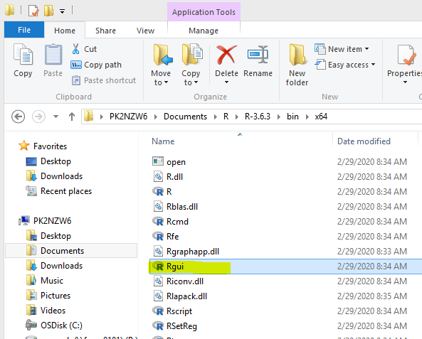
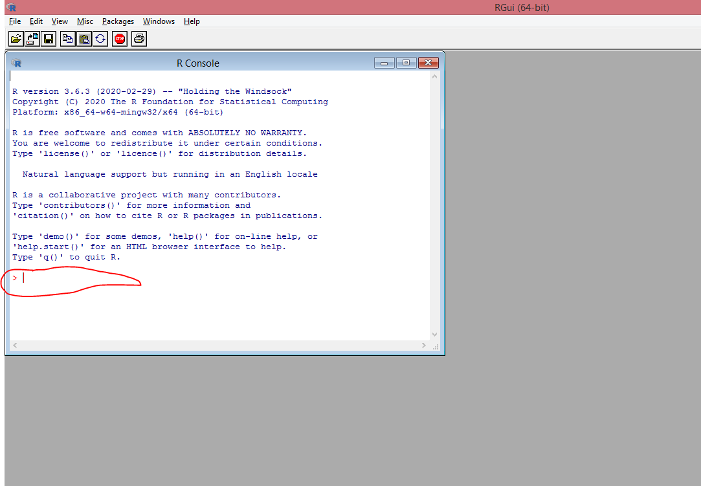

# VisitContactTrace 

[Contact tracing](https://en.wikipedia.org/wiki/Contact_tracing) is a tried-and-true public health method for exploring how infectious diseases spread. The concept is simple – trace the contacts of anyone who tests positive for an infectious disease so that you can notify those contacts about their exposure, monitor for symptoms, and mitigate the spread of disease. This application is designed to facilitate contact tracing on visit-based data with a specific focus on providers of community-based healthcare. In a community-based healthcare system, patients typically are homebound and are visited at home by care providers. This means that direct contact occurs between patients and visit staff in a community-based healthcare system, but there is no direct patient-to-patient contact. On the other hand, hospitals and clinics are examples of facility-based healthcare settings, where direct patient-to-patient, patient-to-staff, and staff-to-staff contact can happen. 

The VisitContactTrace application allows users to load their own visit data in order to:

* explore how infectious disease can spread within a visit-based service delivery model if appropriate precautions are not in place; 

* discover the visit-based contacts of any patient or visit staff member whose disease status is available to you so that you can notify those contacts about their potential exposures.

Important disclaimer: this application **does not suggest causality** or **confirm disease transmission routes**.  It also does not consider potential contacts that occur outside of the visit delivery model, such as contact with family members or friends.


The VisitContactTrace application was created during the COVID-19 pandemic by the Data Science team at the [Visiting Nurse Service of New York](https://www.vnsny.org/) in order to support the organization's contact tracing efforts.  This application can be used for visit-based contact tracing of any infectious disease. Our hope is that VisitContactTrace is useful to agencies providing community-based healthcare and to other organizations that have visit-based service delivery models.

Learn more about VNSNY's COVID-19 response [here](https://www.vnsny.org/coronavirus-covid-19/vnsnys-covid-19-response/). 


## Table of Contents  
[Requirements for the VisitContactTrace Application](#requirements)  
      [Installing the VisitContactTrace R package](#installapp)  
      [Running VisitContactTrace on Your PC](#runapp)  
      [Input Data Type and Structure](#inputdata)  
      [Data Specifications](#dataspec)     
[Using the VisitContactTrace Application](#useapp)  
      [Try VisitContactTrace with Demonstration Feature](#demodata)    
      [Importing Data](#importdata)  
      [Querying VisitContactTrace](#queryapp)  
      [Exit/Reload data](#exitapp)  
[The Output/Results](#results)  
      [Output - Plot](#outputplot)  
      [Output - Contact Lists](#outputcontactlists)  
      [Output - Visit Details](#outputdetails)  
[Other Useful R Functions/Objects (for experienced R users)](#advancedR)  
[Help Getting Started with R](#helpR)  
[License](#license)  
[Acknowledgments](#thanks)  
    
    
# Requirements for the VisitContactTrace Application <a name="requirements"></a>

VisitContactTrace is an application that runs in R, an open-source software for UNIX platforms, Windows, and MacOS. You must have R installed to use VisitContactTrace. For more information about R, visit the [R Project for Statistical Computing](https://www.r-project.org/). If you do not have R installed on your computer or do not have much experience with R, go to [Help Getting Started with R](#helpR) before continuing to the next section.

The VisitContactTrace application allows users to **upload their own data.**  For example, you may have access to a data extract from a standard report of service encounters from your organization's electronic medical record system. You can save this data file as an *.xlsx or *.csv file and upload it to the VisitContactTrace application.  More sophisticated R users can adapt the application's source code to read in datasets created from an ETL tool or incorporate the code into a data workflow.  [More on the data specifications](#dataspec)


## Installing the VisitContactTrace R package <a name="installapp"></a>

You must run the following code in R the first time you use VisitContactTrace (and anytime you switch versions of R).  This step may take a while to run (several minutes depending on your internet connection), as many R packages will auto-download and install before VisitContactTrace will work successfully.  Copy and paste the following lines of code (preserving the upper- and lower- case letters) into the R Console to install the development version of **VisitContactTrace** from GitHub. The packages may begin to download automatically, or you might have to hit "enter" on the keyboard once. 

```r
depend.pack <- c('anytime', 'shiny', 'shinydashboard', 'pals', 'shinyFiles', 'shinycssloaders', 'shinyWidgets', 'data.table', 'assertthat', 'dplyr', 'purrr', 'rmarkdown', 'visNetwork', 'DT', 'fst', 'stringr', 'shinyalert', 'epicontacts', 'fs', 'readxl', 'shinyjs')
install.packages(depend.pack, dependencies=TRUE, repos="http://lib.stat.cmu.edu/R/CRAN/")
# VNSNY Internal Employees Only (Remove before making public)
install.packages("http://stats.vnsny.org/VisitContactTrace/VisitContactTrace_0.1.0.tar.gz",repo=NULL,type="source")
# Public version install
# install.packages("VisitContactTrace", repos = "https://github.com/vnsny-bia/VisitContactTrace")
```
You will know that the packages have installed and that R is ready for the next command when you see your cursor on a blank carat prompt line in the R console:
```r
>
```
If you don't see a blank carat prompt line, try hitting "enter" on the keyboard until you do. You can proceed to [running VisitContactTrace](#runapp) once you see the carat prompt appear.

## Running VisitContactTrace on Your PC <a name="runapp"></a>

Type the following commands (preserving the upper- and lower- case letters) into the R Console in order to start the application. If you don't see your cursor on a blank carrot prompt line (">"), then hit "enter" on the keyboard:

```r
library(VisitContactTrace);
VisitContactTrace();
```
Run these two commands from an R session every time you want to use VisitContactTrace. When you run these commands, the VisitContactTrace application should launch in a web browser. VisitContactTrace works best in a Google Chrome browser; if you use a different browser, you can copy and paste the URL into a Google Chrome browser for the best performance.

When you want to quit the application, follow the directions in the [Exit/Reload data section](#exitapp).

## Input Data Type and Structure <a name="inputdata"></a>

The VisitContactTrace application supports a data structure commonly used for billing and clinical record documentation in community-based healthcare settings. This data structure is known as "encounter data" or "visit data," and was the motivation for creating this application.  

The image below shows a snippet of an example dataset where a handful of clinicians have delivered visits to a few patients during February - May 2020. In this simulated sample dataset, Patient 4 was first visited by [Anna Caroline Maxwell](https://en.wikipedia.org/wiki/Anna_Maxwell) on February 27, 2020, followed by several visits by [Lillian Wald](https://en.wikipedia.org/wiki/Lillian_Wald) every 2-6 days from February 29, 2020 to March 31, 2020.



The VisitContactTrace application uses only these visit interactions or "encounters" between visit staff and patients to determine the contacts of an infected person in a visit-based service delivery model.  While it's possible for visit staff to interact with each other under certain circumstances, VisitContactTrace was built assuming that this happens rarely and currently does not support contact tracing for those interactions.  

You can use VisitContactTrace for other visit-based service delivery models outside of community-based healthcare. As long as the data used in the application represent "visit encounters" and are in the format specified [below](#dataspec), you will be able to use VisitContactTrace to explore your data.

## Data Specifications <a name="dataspec"></a>

You need to save your dataset as a *.xlsx or *.csv file to upload it to VisitContactTrace. If you have several sheets in your *.xlsx file, your dataset must be in the first sheet. Your column names should be the first row in your dataset. Here are the data fields that VisitContactTrace recognizes:

| Column Name | Format | Required | Description |
| --------------- | --------------- | --------------- |----------------------------------------------------------------------------|
| PATIENT_ID | Character | FALSE | Unique identifier of patient.  If this column is absent, **PATIENT_NAME** is used instead. |
| PATIENT_NAME | Character | TRUE | First and last name of patient.* If the **PATIENT_ID** column is absent, this column is used as the unique identifier for patients. |
| VISIT_DATE | DATE | TRUE | The date that a visit staff member visits a patient. Acceptable date formats include '2004-03-21 12:45:33.123456', '2004/03/21 12:45:33.123456', '20040321 124533.123456', '03/21/2004 12:45:33.123456', '03-21-2004 12:45:33.123456', '2004-03-21', '20040321', '03/21/2004', '03-21-2004', '20010101' |
| STAFF_ID | Character | FALSE | Unique ID for visit staff member.  If this column is absent, **STAFF_NAME** is used instead. |
| STAFF_NAME | Character | TRUE | First and last name of visit staff member*. If the **STAFF_ID** column is absent, this column is used as the unique identifier for visit staff members. |
| PATIENT_STATUS | Character | FALSE |  Labels used to indicate a status for each **patient**, such as confirmation of an infectious disease or some other status (e.g. "POSITIVE", "NEGATIVE", "SUSPECTED").  This label is case-sensitive (meaning that "Positive", "positive", and "POSITIVE" are all considered different statuses) and must be applied to all applicable visit observations for the **patient**.  See the Output - Plot section to learn how the application uses this column. |
| STAFF_STATUS | Character | FALSE |  Labels used to indicate a status for each **staff member**, such as confirmation of an infectious disease or some other status (e.g. "POSITIVE", "NEGATIVE", "SUSPECTED").  This label is case-sensitive (meaning that "Positive", "positive", and "POSITIVE" are all considered different statuses) and must be applied to all applicable visit observations for the **staff member**.  See the Output - Plot section to learn how the application uses this column. |

\* If you work with data where patient/staff names are stored in two columns (first name & last name), you can consider concatenating those columns prior to uploading the data into the application.

If you have any columns in your dataset that aren't mentioned in the table above, VisitContactTrace will ignore them. The columns in your dataset can be in any order. PATIENT_NAME, STAFF_NAME, and VISIT_DATE are required columns and must be spelled exactly as specified. You'll get an error message if you attempt to upload a data file without these required columns, but you can rename the columns directly in the "Upload Data" screen from within the application.  

For best performance, you should consider bringing in PATIENT_ID and STAFF_ID from a data source that treats these fields as a unique key (i.e. these columns should uniquely identify specific patients and staff members). VisitContactTrace works best when PATIENT_ID and STAFF_ID are provided.  If either of these columns are not available, the application will use the PATIENT_NAME and STAFF_NAME columns to uniquely identify a patient or staff member, respectively. If your dataset does **not** include the PATIENT_ID and STAFF_ID columns, you should be careful to:
* Address inconsistencies in spelling, use of upper- and lower- case letters, use of extraneous spaces, and the order of first and last names in PATIENT_NAME and STAFF_NAME. For example, "Lillian Wald", "lillian wald", "Wald, Lillian", and "Lillian  Wald" (with 2 spaces between first and last name instead of one) would all be treated as different individuals. Similarly, ["Hazel Johnson-Brown"](https://en.wikipedia.org/wiki/Hazel_Johnson-Brown) and "Hazel Johnson Brown" (not hyphenated) would be treated as different individuals as well. 
* Make sure that you represent patients or staff that share the same name differently in the dataset. For example, if two different patients are named "John Doe", then you should make the patient names distinct in some way (e.g. "John Doe DOB 2/3/1950" and "John Doe DOB 4/26/1933").

The VisitContactTrace application will not produce accurate results if your data have any integrity or completeness issues. Please take the following into consideration when you prepare a data file to upload into the application:

* Preprocess the data to make sure that each row in the dataset represents a direct person-to-person visit per day.
  * Do not aggregate data from several days into one row.
  * Only use one row to represent a unique patient/staff/date combination. If a staff member visited the same patient several times during the same day, your dataset should have only one row to represent those same-day visits.
  * Exclude telephonic "visits" or encounters.
* Keep in mind the range of visit dates in your dataset when you use the application.
  * For example, if you load a dataset that contains visits from April 2020, then VisitContactTrace will only return results that apply to April 2020 and will not be able to return results about visits from March 2020 or May 2020.

We may not have anticipated all of the pitfalls associated with uploading your own dataset into VisitContactTrace.  Please be thoughtful about other considerations that are relevant to your organization's data when you upload a dataset into the application.


# Using the VisitContactTrace Application <a name="useapp"></a>

The following figure is the welcome screen that appears as soon as the application opens and you have clicked on "accept" to the license information. 



## Demo Data <a name="demodata"></a>

If you don't have data available but would like to experiment with the application, you can try out the simulated dataset that comes with the VisitContactTrace application.  Click on the "Try Out Demo Data" button on the bottom right hand corner of the welcome screen.

## Importing Data <a name="importdata"></a>

If you have data you would like to use, click on "Choose Data File" and browse to the dataset you want to import into the VisitContactTrace application.  

The "View Selected File" button lets you preview your data and rename your columns to the names defined in [data specifications](#dataspec). If your column names and data formats are correct, you can click on "Use Selected File" to import the data into the application.  If they are not correct, you will get an error message.




## Querying VisitContactTrace <a name="queryapp"></a>

Once you have loaded data into the application, you are ready to start using VisitContactTrace. First, identify an individual in the dataset that you will consider as the “index” person in a contact tracing investigation. If you have a list of individuals (patients and/or staff members) who have tested positive for an infectious disease, any of those individuals can serve as the "index" person to conduct contact tracing on. Note that the application itself will not let you know which individuals need contact tracing.

Instructions for entering your inputs:
* Choose whether you are starting with an index staff member or a patient by clicking the on the “Staff” or “Patient” tile at the top of the application. 
* Choose the Staff ID (or Patient ID) of the index person by selecting the ID/name from the drop-down. You can start typing the ID/name in order to narrow the results in the drop-down menu.
* Choose the reference date. For example, this could be the date of symptom onset for the index person. 
* Choose the number of days to look back from the reference date (e.g. the incubation period of the disease) and the number of days to look forward from the reference date.  Consult your organization's policies & procedures for specific guidance regarding the use of index dates and tracing periods.

**Click on the “Run” button.**

Please note that depending on your PC’s hardware, the size of your dataset, and the date range you select, you may experience long computation times.  

In the screenshot below, we have selected [Florence Nightingale](https://en.wikipedia.org/wiki/Florence_Nightingale) as the index staff person for visit-based contact tracing of a novel infectious disease.  In this hypothetical example, we use her symptom onset date, May 12, 2020, as the reference date. We set the contact tracing to start 7 days prior to that date (to account for a 7-day incubation period of the novel infectious disease) and to end 2 days afterwards (to account for visits that she delivered while she was symptomatic as well as to capture a longer window for secondary and tertiary contact visits to have occurred).  When we select these parameter inputs, the application displays some helpful messages immediately below the run button: "The date range of visits available for the individual is 2020-02-03 to 2020-05-21. All visits during 2020-05-05 through 2020-05-14 will be shown based on your inputs."  




## Exit/Reload data <a name="exitapp"></a>

In the top right-hand corner of the application (the small down arrow icon), you'll find a drop-down menu that contains options for exiting the application or reloading the screen to upload a new dataset.  It is best to exit the application by clicking on "Exit" in this window because this correctly closes the VisitContactTrace application from the R session. 


# The Output/Results <a name="results"></a>

When you hit the "run" button, all results will appear on the right-hand panel of the application. There are three results tabs: Plot, Contact Lists, and Visit Details. 

Behind the scenes, VisitContactTrace first identifies the primary visit-based contacts of the index person you selected during the window of time you specified.  Then, it identifies the visit-based contacts two to three orders of separation away from your index person.  The visits for these contacts must have occurred after the primary contact visit dates (and tertiary contacts visits must occur after the secondary contact visits). 

#### Definition of Primary, Secondary Tertiary Contacts




## Output - Plot <a name="outputplot"></a>

The "Plot" tab displays a "network diagram" of primary, secondary, and tertiary contacts.  It is useful for visualizing how an infectious disease can spread exponentially within a visit-based population. You can hover over the patient and staff icons to see individual details (ID, name, status) or click on an icon in order to highlight the direct contacts of an individual. 

If you included patient/staff statuses in your dataset, the plot legend will display each distinct status type. VisitContactTrace applies **the most recent status for each patient or staff within the visit window you request**. For example, imagine that Patient A has a status of "NEGATIVE" for visits on 5/1, 5/2, 5/3, and 5/4, and then a status of "POSITIVE" for visits on 5/5 and 5/6. If you select 5/4 as the end of the visit window for Patient A, then Patient A will be labeled as "NEGATIVE" in the plot. If you select 5/5 or 5/6 as the end of the visit window for Patient A, then Patient A will be labeled as "POSITIVE" in the plot.




## Output - Contact Lists <a name="outputcontactlists"></a>

The "Contact Lists" tab displays the primary, secondary, and tertiary contact lists (available in separate subtabs under "Contact Lists"). You can download these lists into .csv by clicking on the "Download" button. The contact lists identify which of your patients/staff are primary, secondary, or tertiary contacts of your index person, and when those contacts made or received visits.


## Output - Visit Details <a name="outputdetails"></a>

The "Visit Details" tab includes all primary, secondary, and tertiary contact visit details together to show information on "who visited whom on what date?"  You can download these results into .csv.  If your input dataset included patient/staff statuses, this tab will show the statuses that correspond to each patient/staff member on each given visit date.  


## Exit the application

See [this section](#exitapp) when you are ready to exit the VisitContactTrace application or reload data.


# Other Useful R Functions/Objects (for experienced R users) <a name="advancedR"></a>

If you are an experienced R user, you can explore and experiment with a sample simulated Home Healthcare Visits dataset (visitshc.RData)  included in the VisitContactTrace R package.

```r
head(visitshc, 10)
```

More experienced R users may want to access the contact tracing R function directly.  The getContacts function returns a dataframe of primary, secondary, and tertiary contacts when the following parameters are specified: the data file, the ID of the index patient/staff, reference date, and number of days forward/back.

```r
# The Below example will produce contact tracing lists based on staff id.
            
getContacts(staff_id= '1',
             patient_id = NA,
             reference_date = "2020-03-01",
             look_forward_days = 20,
             look_back_days = 3,
             data= hcvisits,
             plot=FALSE)
```
# Help Getting Started with R <a name="helpR"></a>

## Installing R Software

You must have R installed to use VisitContactTrace.  To learn more about R, please visit the [R Project for Statistical Computing]( https://www.r-project.org/).  To install R, first choose a CRAN mirror from [here](https://cran.r-project.org/mirrors.html).  Choose any location as the CRAN mirror; it doesn't matter which one you select.  Once you click on a CRAN mirror, it will bring you to a page where you can download and install R. Choose the correct operating system (e.g. Linux, Mac, Windows) to download the relevant installation file.  

For Windows users: After selecting the CRAN mirror and correct OS, click on "base," and click on "Download R.#.#.#".  

If the R installation is successful a shortcut for R should appear.  Click on that shortcut to open the R application.

## Opening the R Graphical User Interface application ###

### Instructions for Windows environments 

If your organization requires administrative rights to install software, you might not be able to install R in certain folders such as C:\Program Files. You may, however, be able to install R in your local storage without administrative rights by installing R in the "documents" directory associated with your user account.  Below is an example of how this might appear in a Windows environment.  

To launch R, you need to find the **Rgui.exe** executable file. The easiest way to find it is to use your computer's search function. Otherwise, you can find the **Rgui.exe** executable file in a sub-directory within the directory that you selected during installation. For example, if you installed R in "Documents", then Rgui.exe might be in the following places:
* Documents --> R --> R-#.#.# --> bin --> x64 --> Rgui.exe
* Documents --> R --> R-#.#.# --> bin --> i386 --> Rgui.exe
* Documents --> R-#.#.# --> bin --> x64 --> Rgui.exe
* Documents --> R-#.#.# --> bin --> i386 --> Rgui.exe

Click on Rgui.exe to launch an R session and to view the R console.  If you will be using this application often, consider creating a shortcut for R on your desktop.






## Using the R Console ##

In order to load and run the VisitContactTrace application, you must copy and paste commands into the R Console.  The R Console looks like the image below. You should write or paste the commands here in order to first [install](#installapp) and then to [run the VisitContactTrace application](#runnapp) on your computer.    




## How-to Video <a name="video"></a>
Here is an animated GIF demonstrating the steps from installing R to running VisitContactTrace in a Windows environment.

<center></center>

# License <a name="license"></a>
**VisitContactTrace** is released under [AGPLv3 license](https://www.gnu.org/licenses/agpl-3.0.html). Please see the license in this GitHub repository for additional disclaimers on the usage of this application. 

# Acknowledgments <a name="thanks"></a>


