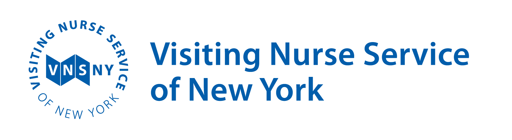
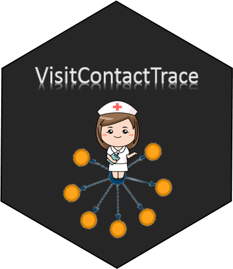
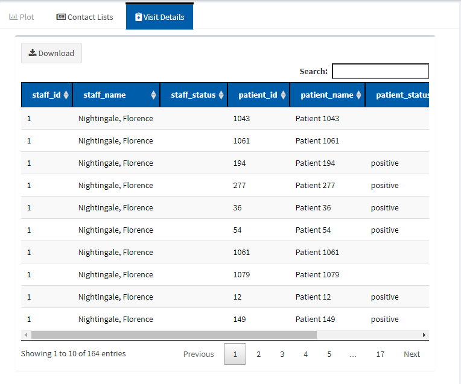

# VisitContactTrace 

This application is designed to conduct contact tracing on healthcare encounter data with a specific focus on providers of community-based healthcare delivery services.  In a community-based healthcare system, patients typically are homebound and are visited at home by healthcare providers.  Thus, while direct contact occurs between patients and visit staff, there is no direct contact between patients. This is in contrast with facility-based healthcare (e.g. hospitals, clinics) settings, where patients travel to a central geographic location at which healthcare services are delivered to several patients at a time, and where direct patient-to-patient, patient-to-staff, and staff-to-staff contact can occur.  The VisitContactTrace application allows the user to load and query their visit data in order to:

* explore how infectious disease might spread within a visit-based service delivery model if appropriate precautions are not in place; 

* conduct visit-based contact tracing of the primary, secondary, and tertiary contacts of an "index" patient or visit staff member whose disease status is known to the user.

This application **does not suggest causality** or confirm disease transmission routes.  Rather, it provides a means to explore how infectious disease may spread exponentially among patients and visit staff if precautions are not put into place in a visit-based service delivery model such as a community-based healthcare setting.




The VisitContactTrace application was designed and created by the Data Science team at the [Visiting Nurse Service of New York](https://www.vnsny.org/) during the COVID-19 pandemic in order to support the organization's contact tracing efforts.  This application can be used for the purpose of visit-based contact tracing of any infectious disease and may be of value to other agencies providing community-based healthcare or to organizations that have visit-based service delivery models.

Learn more about VNSNY's COVID-19 response [here](https://www.vnsny.org/coronavirus-covid-19/vnsnys-covid-19-response/). 


## Table of Contents  
[Requirements for the VisitContactTrace Application](#requirements)  
      [Installing the VisitContactTrace R package](#installapp)  
      [Running VisitContactTrace on Your PC](#runapp)  
      [Input Data](#inputdata)  
      [Data Specifications](#dataspec)     
[Using the VisitContactTrace Application](#useapp)  
      [Importing Data](#importdata)  
      [Exit/Reload data](#exitapp)  
      [Querying VisitContactTrace](#queryapp)  
[The Output/Results](#results)  
      [Output - Contact Lists](#outputcontactlists)  
      [Output - Plot](#outputplot)  
      [Output - Visit Details](#outputdetails)  
[Other Useful R Functions/Objects (for experienced R users)](#advancedR)  
[Help Getting Started with R](#helpR)  
[License](#license)  
[Acknowledgments](#thanks)  
    
    
# Requirements for the VisitContactTrace Application <a name="requirements"></a>

VisitContactTrace is an R package that requires R, an open-source software, to be installed. For more information about R, visit the [R Project for Statistical Computing](https://www.r-project.org/). Inexperienced R users can jump to [Help Getting Started with R](#helpR) for additional guidance.  

The VisitContactTrace application allows users to **upload data manually.**  For example, a user may have access to a data extract from a standard report of service encounters from their organization's electronic medical record system. The user can save this data file as an *.xlsx or *.csv file and upload it to the VisitContactTrace application.  More sophisticated R users can adapt the application's source code to read in datasets created from an ETL tool or incorporate the code into a data workflow.  [More on the data specifications](#dataspec)


## Installing the VisitContactTrace R package <a name="installapp"></a>

The following code must be run in R the first time you use VisitContactTrace (and anytime you switch versions of R).  This step may take a while to run as there are lot of other packages that need to be downloaded and installed before VisitContactTrace can run successfully.  Copy and paste the following lines of code (preserving the upper- and lower- case letters) into the R Console and press "enter" on the keyboard to install the development version of **VisitContactTrace** from GitHub:

```r
depend.pack <- c('anytime', 'shiny', 'shinydashboard', 'viridis', 'shinyFiles', 'shinycssloaders', 'shinyWidgets', 'data.table', 'assertthat', 'dplyr', 'purrr', 'rmarkdown', 'visNetwork', 'DT', 'fst', 'stringr', 'shinyalert', 'epicontacts', 'fs', 'readxl', 'shinyjs')
install.packages(depend.pack, dependencies=TRUE, repos="http://lib.stat.cmu.edu/R/CRAN/")
# VNSNY Internal Employees Only (Remove before making public)
install.packages("http://stats.vnsny.org/VisitContactTrace/VisitContactTrace_0.1.0.tar.gz",repo=NULL,type="source")
# Public version install
# install.packages("VisitContactTrace", repos = "https://github.com/vnsny-bia/VisitContactTrace")
```

## Running VisitContactTrace on Your PC <a name="runapp"></a>

Type the following commands (preserving the upper- and lower- case letters) into the R Console and press "enter" in order to start the application:

```r
library(VisitContactTrace)
VisitContactTrace()
```
Run those two commands from an R session every time you want to use VisitContactTrace.

## Input Data <a name="inputdata"></a>

The VisitContactTrace application supports a common data structure used in community-based healthcare settings for functions such as billing and clinical record documentation. This data structure, known as "encounter data" or "visit data," was the motivation for creating this application. In a community-based healthcare setting, patients are usually homebound or have significant disability, and are not observed to encounter each other. The VisitContactTrace application uses only these visit interactions or "encounters" between visit staff and patients to trace the possible transmission route of an infectious disease in a visit-based service delivery model.  While it is possible for community-based visit staff to interact with each other in the field under certain circumstances, it is an uncommon occurrence, and VisitContactTrace currently does not support contact tracing for those interactions.  The concept of visit-based contact tracing can be used in other visit-based service delivery models outside of community-based healthcare settings.

The image below shows a snippet of an example dataset where a handful of clinicians have delivered visits to a few patients during an observation window of February - May 2020. In this simulated sample dataset, Patient 4 was first visited by [Anna Caroline Maxwell](https://en.wikipedia.org/wiki/Anna_Maxwell) on February 27, 2020, followed by several visits by [Lillian Wald](https://en.wikipedia.org/wiki/Lillian_Wald) every 2-6 days from February 29, 2020 to March 31, 2020.


## Data Specifications <a name="dataspec"></a>

The VisitContactTrace application will not produce accurate results if there are any data integrity or completeness issues. Please take the following into consideration when preparing a data file to upload into the application:

* Preprocess the data to ensure that each row in the dataset represents a direct person-to-person visit per day.
  * Do not aggregate data from several days into one row.
  * Only use one row to represent a unique patient/staff/date combination. If a staff member visited the same patient several times during the same day, the dataset should have only one row to represent those same-day visits.
  * Exclude telephonic or telemedicine "visits" or encounters.
* Keep in mind the range of visit dates included in your dataset when you use use the application.
  * For example, if you load a dataset that contains visits from April 2020, then VisitContactTrace will only return results that apply to May 2020 and will not be able to return results about visits from March 2020 or May 2020.

There may be other precautions necessary that the authors of VisitContactTrace have not anticipated.  Please be thoughtful about other relevant to your organization when uploading a dataset into the application.
  
The **VisitContactTrace** application recognizes the following data fields:

| Column Name | Format | Required | Description |
| --------------- | --------------- | --------------- |----------------------------------------------------------------------------|
| PATIENT_ID | Character | FALSE | Unique identifier of patient.  If this column is absent, **PATIENT_NAME** is used instead. |
| PATIENT_NAME | Character | TRUE | First and last name of patient.* If the **PATIENT_ID** column is absent, this column is used as the unique identifier for patients. |
| VISIT_DATE | DATE | TRUE | The date that a visit staff member visits a patient. Date should be in MM/DD/YYYY or MM-DD-YYYY format |
| STAFF_ID | Character | FALSE | Unique ID for visit staff member.  If this column is absent, **STAFF_NAME** is used instead. |
| STAFF_NAME | Character | TRUE | First and last name of visit staff member*. If the **STAFF_ID** column is absent, this column is used as the unique identifier for visit staff members. |
| PATIENT_STATUS | Character | FALSE |  Labels used to indicate a status for each **patient**, such as confirmation of an infectious disease or some other status (e.g. "POSITIVE", "NEGATIVE", "SUSPECTED").  This label is case-sensitive (meaning that "Positive", "positive", and "POSITIVE" are all considered different statuses) and must be applied to all applicable visit observations for the **patient**.  See the Output - Plot section to learn how the application uses this column. |
| STAFF_STATUS | Character | FALSE |  Labels used to indicate a status for each **staff member**, such as confirmation of an infectious disease or some other status (e.g. "POSITIVE", "NEGATIVE", "SUSPECTED").  This label is case-sensitive (meaning that "Positive", "positive", and "POSITIVE" are all considered different statuses) and must be applied to all applicable visit observations for the **staff member**.  See the Output - Plot section to learn how the application uses this column. |

\* Many users may work with data systems that store patient/staff name in two columns (first name & last name).  Those users should consider concatenating those columns prior to uploading the data into the application.

The columns in the dataset can be in any order. However, PATIENT_NAME, STAFF_NAME, and VISIT_DATE are required columns and must be spelled exactly as specified. The VisitContactTrace application will ignore any columns names that do not exactly match those documented here. It is highly recommended that PATIENT_ID and STAFF_ID are derived from a data source that treats these fields as a unique key - i.e., that these columns uniquely identify specific patients and staff members. When PATIENT_ID and STAFF_ID are provided, the application relies on the integrity of these fields in order to produce accurate contact tracing. If either of these columns are not available, the application will use the PATIENT_NAME and STAFF_NAME columns to uniquely identify a patient or staff member, respectively. Thus, in the **absence of the PATIENT_ID and STAFF_ID columns**, users should be careful to:
* address inconsistencies in spelling, use of upper- and lower- case letters, use of extraneous spaces, and the order of first and last names for the names contained in PATIENT_NAME and STAFF_NAME. For example, "Lillian Wald", "lillian wald", "Wald, Lillian", and "Lillian  Wald" (with 2 spaces between first and last name instead of one) would all be treated as different individuals. Similarly, ["Hazel Johnson-Brown"](https://en.wikipedia.org/wiki/Hazel_Johnson-Brown) and "Hazel Johnson Brown" (not hyphenated) would be treated as different individuals as well. 
* ensure that patients or staff with common names are represented differently in the dataset. For example, if two different patients are named "John Doe", then the patient names should be distinct in some way (e.g. "John Doe DOB 2/3/1950" and "John Doe DOB 4/26/1933").

### Renaming data columns

The user interface for uploading data will raise an error if the user attempts to submit a data file without the required columns. The user interface allows users the option to rename columns with the correct spelling.  


# Using the VisitContactTrace Application <a name="useapp"></a>

## Importing Data <a name="importdata"></a>

The following figure is the welcome screen that appears as soon as the application opens.  Click on "Upload File" and browse to the dataset that you wish to import into the VisitContactTrace application.  


The "Review Data" button provides a preview of the data import and the ability to rename columns to the names defined in [data specifications](#dataspec). If column names and formats are correct, the "Submit Data" button will import the data into the application.  If not, the user will be notified of an error.

The "Try Out Demo Data" button allows users to experiment with a simulated dataset within the application.  


## Exit/Reload data <a name="exitapp"></a>

The top right-hand corner of the application contains a drop down menu that contains options for users to exit the application or reload the user interface to upload data.  It is best to exit the application by clicking on "Exit" in this window, because this correctly closes the VisitContactTrace application from the R session. 

## Querying VisitContactTrace <a name="queryapp"></a>

When using the VisitContactTrace application, the user needs to identify an individual that serves as the "index" person in a contact tracing investigation.  

Querying Parameter Instructions:

* Choose whether you are starting with an index staff member or a patient by clicking the on the “Staff” or “Patient” tile. 
* Choose the Staff ID (or Patient ID) of the index person by selecting the ID/name from the drop-down. You can start typing the ID/name in order to narrow the results in the drop-down menu.
* Choose the reference date. For example, this could be the date of symptom onset for the index person. 
* Choose the number of days to look back from the reference date (e.g. the incubation period of the disease) and the number of days to look forward from the reference date.  Consult your organization's policies & procedures for specific guidance regarding the use of index dates and tracing periods.

**Click on the “Run” button.**

# The Output/Results <a name="results"></a>

The algorithm behind the VisitContactTrace application first identifies the primary visit-based contacts of the index person during the specified window of time.  It proceeds to identify the visit-based contacts two to three orders of separation away from the index person.  These visit-based contacts must have occurred after the primary contact visit dates (and tertiary contacts must occur after the secondary contact visits). 

In the screenshot below, [Florence Nightingale](https://en.wikipedia.org/wiki/Florence_Nightingale) has been selected as the index staff person for visit-based contact tracing of a novel infectious disease.  In this hypothetical example, her symptom onset date was May 12, 2020 and is used as the reference date. The contact tracing is set to start 7 days prior to that date (to account for a 7-day incubation period of the novel infectious disease) and will conclude 7 days afterwards (in order to account for visits that she delivered while she was symptomatic as well as to capture a longer timeframe for secondary and tertiary visits to have occurred).  The calculated begin and end dates for the contact tracing is presented back to the user immediately below the parameter input area: "All visits during 2020-05-05 and 2020-05-19 will be shown."  


#### Definition of Primary, Secondary Tertiary Contacts


## Output - Contact Lists <a name="outputcontactlists"></a>

The right-hand panel of the application displays the primary, secondary, and tertiary contact lists (available in the three tabs under "Contact Lists." The user can download these lists into .csv.


## Output - Plot <a name="outputplot"></a>

The "Plot" tab displays the "network diagram" of primary, secondary, and tertiary contacts.  If the user included patient/staff statuses, the plot legend displays each distinct status type differently. The application applies **the most recent status for each patient or staff within the requested visit window**. For example, imagine that Patient A has a status of "NEGATIVE" for visits on 5/1, 5/2, 5/3, and 5/4, and then a status of "POSITIVE" for visits on 5/5 and 5/6. If the requested window of visits for Patient A ends on 5/4, then Patient A will be labeled as "NEGATIVE" in the plot. However, if the requested window of visits for Patient A ends on 5/5 or 5/6, then Patient A will be labeled as "POSITIVE" in the plot.


## Output - Visit Details <a name="outputdetails"></a>

The visit details tab includes all primary, secondary, and tertiary contact visit details together and can be downloaded into .csv.  If the input dataset included patient/staff statuses, this tab shows the statuses that correspond to each patient/staff member on each given visit date.  In the example shown below, STAFF_ID 1 was the primary contact to patients with PATIENT_IDs 1043 and 1047.



## Other Useful R Functions/Objects (for experienced R users) <a name="advancedR"></a>

The VisitContactTrace R package includes a sample simulated Home Healthcare Visits dataset (visitshc.RData) that users can explore for experimentation and instructional purposes.

```r
head(visitshc, 10)
```

More experienced R users may want to access the contact tracing R function directly.  The getContacts function returns a dataframe of primary, secondary, and tertiary contacts when the following parameters are specified: the name of a visit-based patient-staff encounter data file, the ID of the index patient/staff, reference date, and number of days forward/back.

```r
# The Below example will produce contact tracing lists based on staff id.
            
getContacts(staff_id= '1',
             patient_id = NA,
             reference_date = "2020-03-01",
             look_forward_days = 20,
             look_back_days = 3,
             data= hcvisits,
             plot=FALSE)
```
# Help Getting Started with R <a name="helpR"></a>

## Installing R Software

VisitContactTrace is an R package that requires R software to be installed.  To learn more, please visit the [R Project for Statistical Computing]( https://www.r-project.org/).  You will be asked to choose a CRAN mirror, [also available here](https://cran.r-project.org/mirrors.html).  Choose any location as the mirror, as it does not matter which one you select.  Choose the correct operating system (OS). See more OS tips below.

If the R installation is successful a desktop shortcut for R should appear.  Click on that shortcut to open the R application.

## Opening the R Graphical User Interface application ###

### Instructions for Windows environments 

After selecting the CRAN mirror and correct OS, click on "base," and click on "Download R.#.#.#" 

In organizations that require administrative rights to install software, it is still possible to install R in the user's local storage without administrative rights.  You can find the **Rgui** executable file in the directory in which it was installed. Below are some examples of how this may look; click on Rgui.exe to launch an R session.  If you will be using this application often, consider creating a shortcut on your desktop.


## Using the R Console ##

In order to load and run the VisitContactTrace application, you must copy and paste commands into the R Console.  The R Console looks like the image below. You should write or paste the commands here in order to install and run the VisitContactTrace application on your computer.


# License <a name="license"></a>
**VisitContactTrace** is released under [GPLv3 license](https://www.gnu.org/licenses/gpl-3.0.en.html). Please see the license in this GitHub repository for additional disclaimers on the usage of this application. 

# Acknowledgments <a name="thanks"></a>

* Nurse image used for the hex sticker <a href="http://cliparts.co/clipart/4411">cliparts.co</a>
